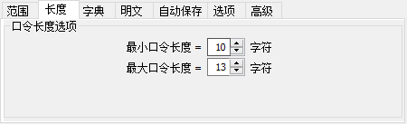

# ez\_forensics

> flag{ba93d8e998e5522c7d800f94125907dc}
## 题解

题目所给附件为证据文件，使用Xways加载

分区2为bitlocker加密分区

很显然需要从分区1中寻找恢复密钥文件

分区1有两个文件，一个zip压缩包和一个png图片

将这两个文件导出

发现zip压缩包中也有一个logo.png

将导出的图片压缩，对比二者的CRC值

相等，遂采用压缩包明文攻击

攻击成功

保存后直接解压即可

得到bitlocker恢复密钥，挂载后使用DiskGenius解密分区

解密后发现flag.txt

将其导出

为编码后的字符串，在线hex解字符串

得到一串莫斯码，再解码

得到一个奶牛快传的下载链接，访问下载

下载后无法正常打开，

观察文件大小刚好为3mb 推测为veracrypt加密容器 ，结合提示的key挂载 

得到一个word文档

将其后缀名改为zip后解压

在/word/media路径下，有两张命名图片

在图片secret.jpeg中，查看属性

有密码1和密码2的提示

再查看exif信息

有一段字符串，

4B5644554D365444474E5347575744324A4A54474357434F4D5A455647524C49

根据提示，base-family，分别进行base16、base32、base64解码

在图片opposite.png中，

查看其十六进制，在png结束后又有一段且结尾为4030B405

正好为504B0304的倒序，猜测为一zip压缩包的倒序

将这段字符串倒序后，另存为zip文件

看到提示为某一日期的时间戳，

直接爆破长度即可（时间戳长度为10或13）

解压即可得到flag

